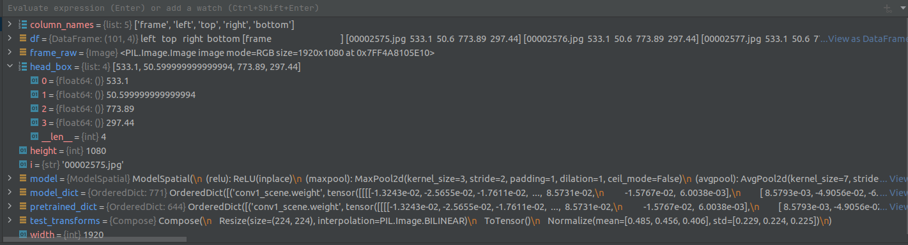
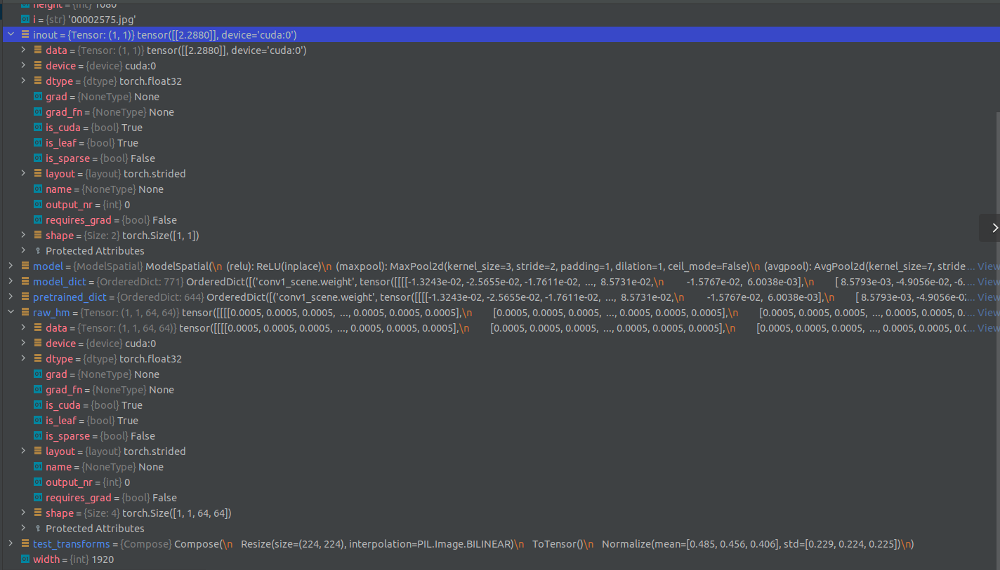

# Code Explained
This is the detailed explanation of the demo code from the repo related to [Detecting Attended Visual Targets in Video](https://github.com/ejcgt/attention-target-detection).


Pycharm is being used to understand the code. Find the detailed explanation of the PyCharm in the related XMind file.

## Using Conda environment in PyCharm
With this repo the `environment.yml` file is provided. In order to use the environment in PyCharm, open the directory that contains the `.yml` file and PyCharm will suggest you to create the environment.

- Note:
  This demo is using the python 3.5, but PyCharm does not support it and suggests to use newer versions! Just ignore it and continue with 3.5 :)
## Overview
  [Debugging skills](https://www.youtube.com/watch?v=k6j1NkVAsuU)
- Logging:

  To understand what is going on instead of printing, logging is used which is better since it saves the output in a log file and doesn't print all of it. To do so, import the logging module, configure it and then use it whenever needed.

  ```
  import logging
  logging.basicConfig(filename='my.log',level='DEBUG')
  ```
  Here we are asking to save the output in a file called `my.log` and we are using it as a debugger. 

## Modules & Libraries
```
import argparse, os
```
- *argparse*

  Parses the defined arguments from the sys.argv. Automatically generates help and usage messages.

  1. Create an ArgumentParser object
  `argparse.ArgumentParser(description='')`
  
      Holds all the information necessary to parse the command line into Python data types.

  2. Adding arguments: `parser.add_argument()`

      Filling an ArgumentParser with information about program arguments. Tells the ArgumentParser how to take the strings on the command line and turn them into objects.

  3. Parsing arguments: `parser.parse_args()`

      Inspects the command line, convert each argument to the appropriate type and then invoke the appropriate action.
```
import torch
import torch.nn as nn
import torch.nn.functional as F
import torchvision
from torchvision import datasets, transforms
import pandas as pd
import numpy as np
import matplotlib.pyplot as plt
import matplotlib.patches as patches
```
- *matplotlib.patches*

  Patches are Artists with a face color and an edge color.
            
```
from PIL import Image
from scipy.misc import imresize
```
- ``imresize`` has been removed from ``scipy`` in the new versions. That is why we should run the code in the environment provided.

```
from model import ModelSpatial
```
- This is a class defined in the [model.py](https://github.com/ejcgt/attention-target-detection/blob/master/model.py) file. A similar architecture to ResNet-50 has been defined inside this class. It contains the 3 pathways for face, scene and attention.
```
from utils import imutils, evaluation
```
- [imutils.py](https://github.com/ejcgt/attention-target-detection/blob/master/utils/imutils.py)
 
  In this file 4 different functions have been defined: `unnorm`, `get_head_box_channel`, ` draw_labelmap`, `multi_hot_targets`.

- [evaluation.py](https://github.com/ejcgt/attention-target-detection/blob/master/utils/evaluation.py)

  In this file 4 different functions have been defined: `auc`, `ap`, ` argmax_pts`, `L2_dist`.
```
from config import *
```
- All the information in the configuration file is imported. Putting a breakpoint for a point after this level it will result in:

## Parsing
It is a way of adding a positional or optional arguments to your code when you run it on the command line. It is easier than oppening the code and adding arguments.
```
parser = argparse.ArgumentParser()
```

Here we are creating an optional argument (since they have `--` in front of their names.) that goes on the end when we run it on the command line. For the first one we are calling it `--model_weights` and we specify that it is a string. `help` is the message that will come up when we ask for help with `-h`.
```
parser.add_argument('--model_weights', type=str, help='model weights', default='model_demo.pt')
parser.add_argument('--image_dir', type=str, help='images', default='data/demo/frames')
parser.add_argument('--head', type=str, help='head bounding boxes', default='data/demo/person1.txt')
parser.add_argument('--vis_mode', type=str, help='heatmap or arrow', default='heatmap')
parser.add_argument('--out_threshold', type=int, help='out-of-frame target dicision threshold', default=100)
```
At the end, we are creating them all and saving them in the `args` variable.
```
args = parser.parse_args()
```
## Functions
1. `_get_transform()`

    This is function that combines 3 different transformations: `Resize`, `ToTensor` and `Normalize`.

    The `input_resolution` used in `Resize` is defined in the [config.py](https://github.com/ejcgt/attention-target-detection/blob/master/config.py) as 224.

```
def _get_transform():
    transform_list = []
    transform_list.append(transforms.Resize((input_resolution, input_resolution)))
    transform_list.append(transforms.ToTensor())
    transform_list.append(transforms.Normalize(mean=[0.485, 0.456, 0.406], std=[0.229, 0.224, 0.225]))
    return transforms.Compose(transform_list)
```
Adding a breakpoin will result in:


2. `run()`
  
  - At the first part of the function `pd.read_csv` from pandas is used to read a comma-seperated values (csv) into a DataFrame. 

    `args.head` is the value that we get from the parsing. either we insert a value or we get a value from the dfault path which heads to the [person1.txt](https://github.com/ejcgt/attention-target-detection/blob/master/data/demo/person1.txt) file.
     
```
def run():
    column_names = ['frame', 'left', 'top', 'right', 'bottom']
    df = pd.read_csv(args.head, names=column_names, index_col=0)
    df['left'] -= (df['right']-df['left'])*0.1
    df['right'] += (df['right']-df['left'])*0.1
    df['top'] -= (df['bottom']-df['top'])*0.1
    df['bottom'] += (df['bottom']-df['top'])*0.1
```
  - What is `df` ?
  Using the `logging` we can understand what is `df` storing. After the definition of `df` use:
  ```
  logging.debug(df)
  ```
  After running the code, in the `my.log` file you will find the frame-name, and information of the left, top, right and bottom columns. Which are giving the positions of the head bounding box.
  


  Changing the 0.1 to 2 in the `df['left']` will result in:
  
  Which is obviously changing the bounding box.

 - Setting up the data transformation

 Here the aforementioned function `_get_transform()` is getting used.

 ```
 test_transform = _get_transform()
 ```

 - Model

  The `ModelSpatial()` class defined in the [model.py](https://github.com/ejcgt/attention-target-detection/blob/master/model.py) file is getting used here.

 ```
    model = ModelSpatial()
 ```
 


 ```
    model_dict = model.state_dict()
 ```
 


 ```
    pretrained_dict = torch.load(args.model_weights)
 ```
 


 ```
    pretrained_dict = pretrained_dict['model']
 ```
 


 ```
    model_dict.update(pretrained_dict)
 ```
 


 ```
    model.load_state_dict(model_dict)
 ```


 ```
    model.cuda()
    model.train(False)
 ```

 - Loop

  Here it disables the autograd, then for each image in the dataset, converts it to RGB and saves its size.
  ```
  with torch.no_grad():
        for i in df.index:
            frame_raw = Image.open(os.path.join(args.image_dir, i))
            frame_raw = frame_raw.convert('RGB')
            width, height = frame_raw.size
 ```
 In oredr to log the `width` and `height` we can use logging here.
 ```
 logging.debug(width)
 logging.debug(height)
 ```
 


  - Head Bounding Box

    The bounding box for the head is extracted using the data from the `df`
      ```
      head_box = [df.loc[i,'left'], df.loc[i,'top'], df.loc[i,'right'], df.loc[i,'bottom']]
      ```
    Adding a breakpoint will show that:
     


 ```
 head = frame_raw.crop((head_box)) # head crop
 ```
 


 ```
 head = test_transforms(head) # transform inputs
 ```
 


 ```
 frame = test_transforms(frame_raw)
 ```
 


 ```
 head_channel = imutils.get_head_box_channel(head_box[0], head_box[1], head_box[2], head_box[3], width, height, resolution=input_resolution).unsqueeze(0)
```


```
 head = head.unsqueeze(0).cuda()
 frame = frame.unsqueeze(0).cuda()
 head_channel = head_channel.unsqueeze(0).cuda()
```
Considering the head, The difference with the output of line 77, is that here the device and shape has changed.
 


  -  Forward Pass

      The raw heatmap (raw_hm) is computed using the `model.py`. The raw_hm created here has the values between 0-1, and the shape (1,1,64,64).
      ```         
        raw_hm, _, inout = model(frame, head_channel, head)
      ```
      


 - Heatmap modulation

    The raw_hm values are adjusted to be between 0-255.
    ```
    raw_hm = raw_hm.cpu().detach().numpy() * 255
    ```
    

  

    ```
    raw_hm = raw_hm.squeeze()
    ```
   The `squeeze()` function is a method in Python's NumPy library that is used to remove any dimensions with size 1 from a NumPy array. In other words, it "squeezes" the raw_hm by removing any dimensions that have only one element.
    


    ```
    inout = inout.cpu().detach().numpy()
    ```
    


    ```
    inout = 1 / (1 + np.exp(-inout))
    ```
    


    ```
    inout = (1 - inout) * 255
    ```
    


    ```
      norm_map = imresize(raw_hm, (height, width)) - inout
    ```
    


- Visualization

  Plotting everything seperately, and finally visualizing all of them on top of each other.
  ```
  plt.close()
  fig = plt.figure()
  fig.canvas.manager.window.move(0,0)
  plt.axis('off')
  plt.imshow(frame_raw)

  ax = plt.gca()
  rect = patches.Rectangle((head_box[0], head_box[1]), head_box[2]-head_box[0], head_box[3]-head_box[1], linewidth=2, edgecolor=(0,1,0), facecolor='none')
  ax.add_patch(rect)
  ```

Two different modes can be used for visualization. You can either choose the arrowm mode, in which the visual target is pointed with an arrow (if part), or the heatmap mode (else part) that specifies the visually attended area with a heatmap.
```
    if args.vis_mode == 'arrow':
        if inout < args.out_threshold: # in-frame gaze
            pred_x, pred_y = evaluation.argmax_pts(raw_hm)
            norm_p = [pred_x/output_resolution, pred_y/output_resolution]
            circ = patches.Circle((norm_p[0]*width, norm_p[1]*height), height/50.0, facecolor=(0,1,0), edgecolor='none')
            ax.add_patch(circ)
            plt.plot((norm_p[0]*width,(head_box[0]+head_box[2])/2), (norm_p[1]*height,(head_box[1]+head_box[3])/2), '-', color=(0,1,0,1))
    else:
        plt.imshow(norm_map, cmap = 'jet', alpha=0.2, vmin=0, vmax=255)

    plt.show(block=False)
    plt.pause(0.2)

print('DONE!')


if __name__ == "__main__":
    run()
```