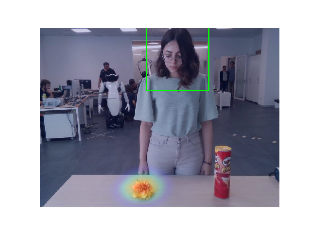
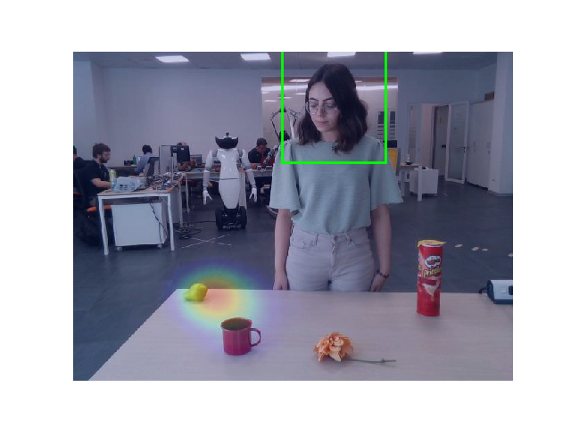
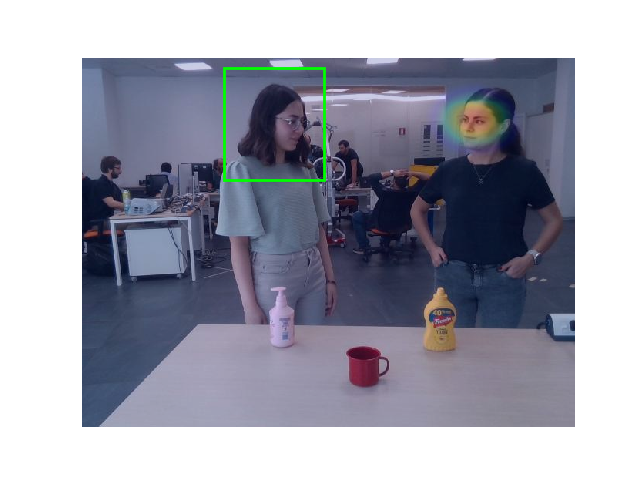
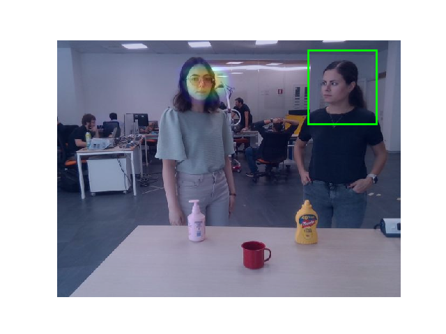

# Feed Input to Demo
At this step, We have prepared Four different input sets, and the related TXT files for the bounding boxes. The aim now is to run the demo with the created input data.

## Step 1: Conda Environment
As specified before, to run the demo a conda environment will be used. Since it has been created before, it is enough to find the environment's name through the list and activate it.
```
conda env list
conda activate MYENV
```
Note: The related env on Dell laptop is `myenv2`.
## Step 2: Modify The Code
To feed our input, modifications should be applied to the `demo.py` code. The path for the input frames and related text file for the bounding boxes should be specified. `TwoPeople_ThreeObjects(2).txt` is for the person on the right.

Modifications: 
- To avoid problems, I placed our input frames in the directory they were already using! 
- Added the related TXT file to the `data/demo` folder and modified the code (line 28).
- Modified the visualization part, so that displays each image a bit longer (line 130). 
```
plt.pause(1)
```
- Added a line to save all the generated figures (line 131).
```
plt.savefig('PATH/fig{0}.png'.format(i))
```
NOTE: There are 4 input sets but 5 text files. That is because for the last set that there are 2 people in the scene the bounding box extraction have been done twice, once for each person. 
## Step 3: Run The Code
Save the modification on the code and run the `demo.py` code.
You can find few examples of results here and the complete folder of `Output` in the repository.
- One person, two objects

 - One person, Four objects

 - One person, Seven objects

 - Two people, Three objects (Person on the left)

 - Two people, Three objects (Person on the right)

## Step 4: Discussion
- The accuracy is low, specially when the gaze is directed to the camera.
- It is better to feed more data since it is using a memory based architecture for the predictions.