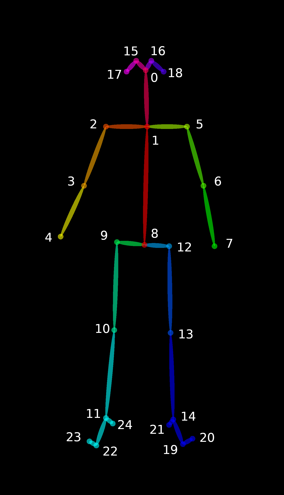

# Developing the Demo Code with Test Set


## Table of Contents
1. [Road Map](#road-map)
2. [Bounding Box Extraction](#bounding-box-extraction)
   
    2.1. [Test Set](#test-set)

    2.2. [Using OpenPose Keypoints](#using-openpose-keypoints)

    2.3. [Code Modification](#code-modification)
3. [Errors](#errors)
4. [Result](#result)


## Road Map
The goal is to add specific features to the demo code. The first step is to replace the manual bounding box extraction with functions and test it. A further step would be to involve YARP and make the application online. The structure is as shown below.


## Bounding Box Extraction
### Test Set
  
There is a [testset]() provided in order to test the initial code. This set contains 3 different folders: `board_images_human` for the 30 images recorded from the camera , `board_images_human_openpose_images` for the 30 skeleton images as an output of the `yarpOpenPose`, and `board_images_human_openpose_json` which represents the keypoints for the skeletons in a JSON format. The information in the JSON file are important to extract the bounding box. Use an [online viewer](https://jsonformatter.org/json-viewer) to understand the JSON file vividly. 

#### JSON File Explained

JSON (JavaScript Object Notation) is an open standard file format and data interchange format that uses human-readable text to store and transmit data objects consisting of attribute–value pairs and arrays. In this case a JSON file for each image represents lists that contain several lists in them. To be more clear, if you consider the file `00000000_keypoints.json` it contains a list of `people` which contains 9 lists:
- `person_id`
- `pose_keypoints_2d`
- `face_keypoints_2d`
- `hand_left_keypoints_2d`
- `hand_right_keypoints_2d` 
- `pose_keypoints_3d`, 
- `face_keypoints_3d`
- `hand_left_keypoints_3d`
- `hand_right_keypoints_3d`

With this file only `pose_keypoints_2d` and `face_keypoints_2d` contains information. For the other lists, since the related flags were not enabled they are empty. 
- `pose_keypoints_2d`: There are 25 keypoints in a skeleton as shown below. For each keypoint its position (x y) and confidence level are recorded. Therefore, this list contains 75 (25*3) elements. 

    To be more clear, element 0 in the list (291.568) is the x for the nose, element 1 (171.459) is the y for the nose and element 2 (0.862217) is the confidenece level for the nose.

    

- `face_keypoints_2d`: There are 70 keypoints in a face as shown below. As mentioned, For each keypoint its position (x y) and confidence level are recorded. Therefore, this list contains 210 (70*3) elements.

    

In summary, For each image there are:

 

### Using OpenPose Keypoints
- `read_openpose_from_json`
  
    In order to use the keypoint information from the JSON file, a function from the [leftright-gaze-estimator-demo](https://github.com/MariaLombardi/leftright-gaze-estimator-demo/blob/master/src/functions/utilities.py) will be used.
    This function loads the JSON file into a Python object. Then, for both pose and face extracts the confidenses and position.

    As a result of `append, delet` and `zip` the indices of the output exactly matches the indices of the keypoints on the image. i.e. poses[0] contains the position of keypoint 0 which is the nose, and conf_poses[0] represents the confidence level of the nose.


- `compute_centroid`
    
    This function is also defined in [leftright-gaze-estimator-demo](https://github.com/MariaLombardi/leftright-gaze-estimator-demo/blob/master/src/functions/utilities.py). It computes the mean of X and Y which will be used when creating the bounding box. 

    Note that `IMAGE_WIDTH` and `IMAGE_HEIGHT` should be defined as constants.

- `get_openpose_bbox`
    
    To extract the bounding box, a function from [face-recogniser-demo](https://github.com/MariaLombardi/face-recogniser-demo/blob/main/src/functions/utilities.py) will be used. This function adds margins to the centroid and creates the bounding box.

    Note that `JOINTS_POSE_FACE` should be defined as a constant and also the `joint_set(p)` function.

### Code Modification
1. Instead of acquiring the head arguments from the parser as a single TXT file, here it should reach each JSON file for each image and get the information from them.
   ```
   listOfJson = glob.glob(JSON_FILES)
   ``` 
2. As mentioned in the [VT_Demo_Code](https://github.com/shivahanifi/visual-targets/blob/main/Demo/VT_Demo_Code.md) The DataFrame, `df`, has the structure as below:

       

    The goal is to use the output of the function `get_openpose_bbox` which is `min_x, min_y, max_x, max_y` directly in the `df`.

    Since there are sepearte JSON files for each image, in the `run` function we will iterate over them to create a single DataFrame. The created `df` will be fed into the rest of the code. 

## Errors
  - List Index Out of Range
  
    There was an index error related to the `get_openpose_bbox` function. The original  function treats the pose as a list. When trying to get the poses related to the joints in the `JOINTS_POSE_FACE` I was receiving the error and getting the log showed that it only was taking the poses related to the first joint only. I am using it inside a loop, therefore the `poses` is in a matrix format and not a list. Modifyin the format as below helped to solve the index problem.
    

    ```
    def get_openpose_bbox(pose):

    n_joints_set = [pose[0][joint] for joint in JOINTS_POSE_FACE if joint_set(pose[0][joint])]
    logging.debug(n_joints_set)
    if n_joints_set:
        centroid = compute_centroid(n_joints_set)

        min_x = min([joint[0] for joint in n_joints_set])
        max_x = max([joint[0] for joint in n_joints_set])
        min_x -= (max_x - min_x) * 0.2
        max_x += (max_x - min_x) * 0.2
        width = max_x - min_x

        min_y = centroid[1] - (width/3)*2
        max_y = centroid[1] + (width/3)*2
        min_x = math.floor(max(0, min(min_x, IMAGE_WIDTH)))
        max_x = math.floor(max(0, min(max_x, IMAGE_WIDTH)))
        min_y = math.floor(max(0, min(min_y, IMAGE_HEIGHT)))
        max_y = math.floor(max(0, min(max_y, IMAGE_HEIGHT)))

        return min_x, min_y, max_x, max_y
    else:
        #print("Joint set empty!")
        return None, None, None, None
    ```
- ValueError: Wrong number of items passed 1, placement implies 5
  
    +There are different ways to create a DataFrame. Here the problem was related to the dimension, since I was assigning a list of data with length of 5 to a list of columns with length of 5, which creates a DataFrame of the shape 5*5. Because a list is fed to the DataFrame vertically. Therefore, the solution was to change the data in the form of list of list so that it has a length of 1 and it fit under the shape of `column_names`.

        ```
        line_to_write = [[j, min_x, min_y, max_x, max_y]]
        ```

- DataFrame not appending the temporary DataFrame

     The problem here is that in order to see the result of append, You need to assign the result back.

    ```
    df = df.append(df_tmp, ignore_index=True)
    ```
- TypeError: join() argument must be str or bytes, not 'int'
  
    The problem is that the names for the JSON files is different from the names for the images and it is not possible to open the i images with those names. To overcome the issue, I used `STRING.split()` to give the exact names of the images and match them with related JSON files.

    ```
    #extracting image names
    idx = []
    for b in listOfJson:
        txt = b.split('/')
        txt1 = txt[6].split('_')
        txt2 = txt1[0] + '.jpg'
        idx.append(txt2)
    ```
    Used the image names when opening the images:
    ```
    frame_raw = Image.open(os.path.join(args.image_dir, str(idx[i])))
    ```
- The image sizes were also changed using:
    ```
    plt.rcParams["figure.figszie"] = [20.00,20.00]
    ```
## Result
The figure is a sample of the result. The complete set of results and a video is provided in the related repository.

