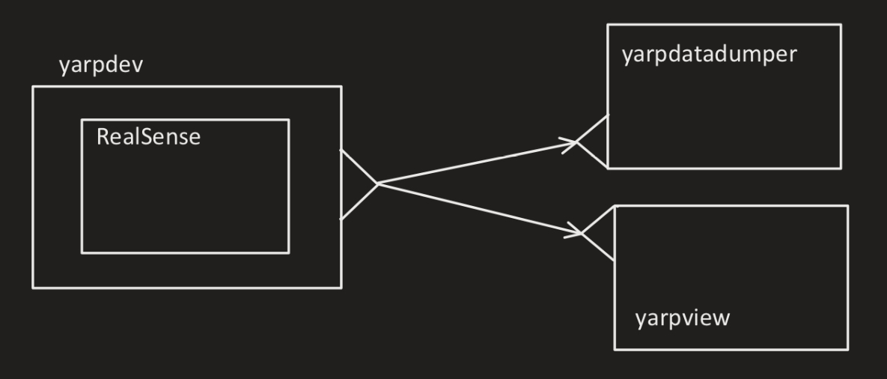

# Collecting Input Data

The goal here is to collect input images using the RealSense camera. These images will be used as an input for the [demo](https://github.com/ejcgt/attention-target-detection/blob/master/demo.py). Note that the architecture is predicting attended visual targets in videos, therefore, the images should be frames out of a video and in sequence. To properly use RealSense we can either use YARP or RealSense Viewer. 

## Table of Contents:
1. [YARP](#yarp)


   1.1. [How to use docker](#docker)

   1.2. Application Description

   1.3. Collected Data
2. Intel RealSense Viewer

## YARP <a name="yarp"></a>
In order to use YARP, the YARP RealSense Device should be among the YARP devices. Check it with 
```
yarpdev --list
```
In case it is not present, add it following the link [yarp-device-realsense2](https://github.com/robotology/yarp-device-realsense2).

In our case, to have all we need, a docker is used. This is a docker from the [mutual-gaze-classifier-demo](https://github.com/MariaLombardi/mutual-gaze-classifier-demo/tree/main/app) repository.

- How to use the docker? <a name="docker"></a>
  
  1. Clone the repository to your local machine and build the docker. You need to build it once.
  ```
    docker build --build-arg "START_IMG=pytorch/pytorch:1.4-cuda10.1-cudnn7-devel" --build-arg "release=master" --build-arg "sbtag=Unstable" -t mutual_gaze .
  ```

  NOTE: If there is an error while building, it is probably related to the version mismatches. Check the public key and swig versions and update them in the docker file.

  2. Connect the RealSense camera before initiating the docker environment.
  3. In the terminal, head to the location in which you have stored the `demo_docker` file.
   ```
   xhost +

   nvidia-docker run --rm -it --privileged --gpus 1 -e QT_X11_NO_MITSHM=1 -e DISPLAY -v /tmp/.X11-unix:/tmp/.X11-unix -e NVIDIA_DRIVER_CAPABILITIES=compute,utility,graphics --hostname dockerpc --network=host --pid=host mutual_gaze
   ```

   The xhost command adds or deletes host names on the list of machines from which the X Server accepts connections.

   After entring the environment you will see the  `root@dockeropc` in the terminal.
   In order to run the YARP you have to head to the `projects` folder. If you list (ls) the folders in the projects you will see all the tools needed are included here.
   ```
   yarpserver --write
   ```
   1. To open another terminal in the docker environment, you can simply run the code below. To find the container ID use the code `docker ps` to see the list of the environments and their ID.
   ```
   docker exec -it <id_container> bash
   ```
   1. To get out of the docker environment, first `Ctrl+c` and then type `exit`.
   
The installed docker did not contain the driver for the RealSense camera, first we installed it and committed the changes in the docker.
  

## Application Description
  Having the yarp RealSense device installed properly, now we need an application XML file to properly connet the ports and modules. The structure we need is as below:
  

  1. `yarpdev` is the wrapper for the RealSense camera. It automatically holds open a YARP port which is called `/depthCamera/rgbImage:o` in the application file. Since it is being used through the docker, the path for the parameters should be specified from the docker. to find the path:
   ```
   pwd RealSense_conf.ini
   ``` 
  Also the node for this module should be specified as docker and not the local host.

  2. [yarpdatadumper](https://www.yarp.it//v3.5/yarpdatadumper.html#yarpdatadumper_intro) acquires and stores Bottles or Images and Videos from a YARP port. It automatically opens a port that we call it `/code_sh/VTDataCollection:i`. The name for this module will specify both the port name and location where the output will be saved. There will be a folder generetad in the path you specify, which will contain the images and a file called 'info.log' is produced containing information about the data type stored within the 'data.log' file as well as the logged time stamps and the name of the yarp ports connected or disconnected to the dumper.
  
      NOTE: Since the frame rate is 30 frames per second, and we need time to change the gaze direction and record the image, we use the `--downsample n` flag, which reduceS the storing rate by a factor n, i.e. the parameter n specifies how many items (bottles or images) shall be skipped after one acquisition.
  3. `yarpview` is used to display the input recieved from the camera. The port is called `/view/rgb`.
  
  NOTE: Here the modules used automatically have ports and there is no need to define ports in a seperate python file.

  Find the related application in [VT_Input_Data.xml](https://github.com/shivahanifi/visual-targets/blob/main/Demo/VT_Demo_OurData/VT_Input_Data.xml). In this application since we are using the docker, it is like using two seperate machines. To make the distributed application run, we have to set both the local machine and the docker to work in the same namespace.
  ```
  yarp namespace /shiva
  ```
  If you check the namespace list now you will see only the local machine, but using the command `yarprun` you will create a client-server environment that is able to run the program on a set of machines. Now if you display the list of names you will also see the docker.
  ```
  yarprun --server /docker
  yarp name list
  ```

## Collected Data
The data have been collected in 4 different scenarios.
1. [One person in the scene and two objects on the table.]()


1. [One person in the scene and four objects on the table.]()
2. [One person in the scene and seven objects on the table.]()
3. [Two people in the scene and three objects on the table.]()

## Intel RealSense Viewer
This is another way to record video/image with the RealSense Camera. To do so, install the [RealSense SDK](https://www.intelrealsense.com/sdk-2/). One of the tools is the `Viewer`. Find the user's guide for the viewer [here](https://www.intelrealsense.com/download/7144/).
After installation initiate the viewer:
```
realsense-viewer
```
For this task you can record the RGB camera. However, the output of this recording is in the `.bag` format, which can be transformed into JPEG using [rosbag](http://wiki.ros.org/rosbag/Tutorials/Exporting%20image%20and%20video%20data).


