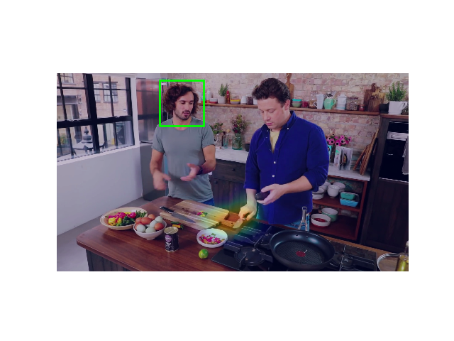

This is a detailed explanation of running the demo from the repo related to [Detecting Attended Visual Targets in Video](https://github.com/ejcgt/attention-target-detection).

# Running The Demo

### Conda Environment

To avoid version mismatches and errors, it is always recommended to use the environment they have pprovided.

  - Environments


Anaconda Server enables you to upload, move, copy, share, and download an environment yaml file. An environment is a folder or directory that contains a specific collection of conda packages and their dependencies. This allows them to be maintained and run separately without interference from each other.

 Use environments such as yml or docker when you are using others code, it will prevent version mismatching errors.

- YAML

  YAML is a data serialization language that is often used for writing configuration files. Depending on whom you ask, YAML stands for yet another markup language or YAML ain't markup language (a recursive acronym), which emphasizes that YAML is for data, not documents.

### Recreating The Environment

1. Installing Conda
  
    If you don't have conda installed, follow the instructions [here](https://docs.conda.io/projects/conda/en/latest/user-guide/install/linux.html).

    ### Note:        
    Conda is a package manager. It helps you take care of your different packages by handling installing, updating and removing them. 
  
    Anaconda contains all of the most common packages (tools) a data scientist needs and can be considered the hardware store of data science tools.

    Miniconda is different from Anaconda in the sense of number of packages and interface.

2. Creating The Environment

    Follow the instructions provided [here](https://docs.conda.io/projects/conda/en/latest/user-guide/tasks/manage-environments.html#creating-an-environment-from-an-environment-yml-file)

    ### Errors!
    - Python & pip
    
      There was a problem with the Python and pip versions.

      Python 3.5 was required. But since it is an old version, it was not in the repositories that ubuntu was looking for. Solved this probvlem by providing the address to the repos that python 3.5 exists in.
      ```
      sudo add-apt-repository ppa:deadsnakes/ppa

      sudo apt-get update

      sudo apt-get install python3.5
      ```

      Also pip 10 was required, to install the pip for the python 3.5:
      ```
      sudo apt-get install -y python3.5-pip
      ```

      STILL GETTING 'PIP FAILED' ERROR.


  - Namig The Environment

    When creating the environment, name it specifically otherwise Conda will name it and replace it with new environments everytime it creates one. 

    ```
    conda env create --name <Env Name> -f environment.yml
    ```
      ### Note:

      If you need to delete an environment use these codes:
      ```
      conda remove --name <Env Name> --all

      conda clean -a

Didn't reach a clear solution!

## Errors
Without the environment too many errors will appear.
- ``from scipy.misc import imresize``
  
  ``SciPy`` is a scientific computation library that uses NumPy underneath. SciPy stands for Scientific Python. It provides more utility functions for optimization, stats and signal processing. Like NumPy, SciPy is open source so we can use it freely.
  
  There is a problem with ``imresize`` ,there are similar functions therefor it has been removed from ``scipy``. The suggested solutions for this problem include:

  1. Downgrading ``scipy`` to the version 1.1.0
   
    ```
    pip3 install scipy==1.1.0
    ```
    There was a ``legacy-install-failure`` error and didn't work.

  2. Using the resize function from OpenCv.
   ```
   import cv2
    cv2.resize(img, size)
   ```

   This solution works.
- `'Window' object has no attribute 'move' `(Line 90)
- `Module 'numpy.random' has no attribute 'Bitgenerator'`

  That's an error introduced by numpy 1.18. They moved an interface to a different location without deprecating the old name. 
  
  To solve the problem add these lines on top of the code:

  ``` 
  import numpy
  numpy.random.bit_generator = numpy.random._bit_generator
  ```   
  Didn't work.

# Environment Created

If you managed to create the environment successfully, now you should run the demo code in that environment. Make sure you have the GPU related stuff (CUDA, Nvidia, cudNN, etc.).
```
python demo.py
```
## Errors
1. `No such file or directory: model_demo.pt`

  This is a file that has the model weights saved as a tensor. Usually this kind of file is not included in the repo and they give a link to download it, which is also the case in here. This error will be solved by downloading the `download_model.sh` file.
  ```
  sh download_models.sh
  ```

# Result 
Running the code correctly will result in frames like


